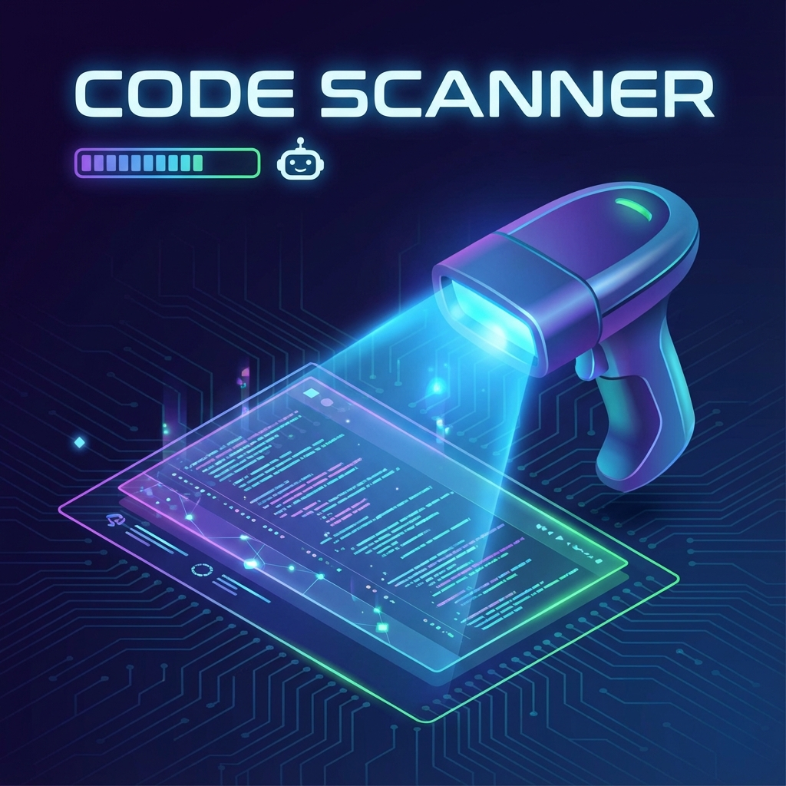
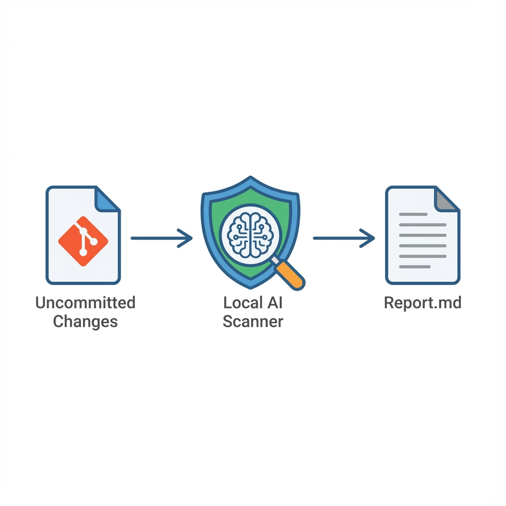

# Code Scanner



AI-powered code scanner that uses local LLMs (LM Studio or Ollama) to identify issues in your codebase based on configurable checks.

## Features

- **Language-agnostic**: Works with any programming language
- **Local AI (Privacy first)**: Uses LM Studio or Ollama with local APIs. Your code never leaves your machine.
- **Hardware Efficient**: Designed for small local models. Runs comfortably on consumer GPUs like **NVIDIA RTX 3060**. (e.g., GPT OSS 20b runs smoothly on an **RTX 4070 8GB** via LM Studio).
- **Cost Effective**: Zero token costs. Use your local resources instead of expensive API subscriptions.
- **Continuous Monitoring**: Automatically runs in background mode, monitoring Git changes every 30 seconds and scanning indefinitely until stopped
- **Git integration**: Monitors repository changes and scans modified files; when changes are detected mid-scan, continues from current check with refreshed file contents (preserves progress)
- **Configurable checks**: Define custom checks via TOML configuration with file pattern support
- **Issue tracking**: Tracks issue lifecycle (new, existing, resolved)
- **Real-time updates**: Output file updates immediately when issues are found (not just at end of scan)
- **Markdown output**: Generates readable reports in `code_scanner_results.md`



## Documentation

- **[Getting Started](docs/getting-started.md)** - Quick installation and first run
- **[Linux Setup](docs/linux-setup.md)** - Detailed Linux installation guide
- **[macOS Setup](docs/macos-setup.md)** - Detailed macOS installation guide
- **[Windows Setup](docs/windows-setup.md)** - Detailed Windows installation guide

## Supported LLM Backends

Code Scanner supports two local LLM backends:

| Backend | Best For | Installation |
|---------|----------|--------------|
| **[LM Studio](https://lmstudio.ai)** | GUI users, trying different models | Download from lmstudio.ai |
| **[Ollama](https://ollama.ai)** | CLI users, automation, simpler setup | `curl -fsSL https://ollama.ai/install.sh \| sh` |

Both backends run entirely on your local machine - your code never leaves your computer.

## Installation

```bash
# Using UV (recommended)
uv sync

# Or using pip
pip install -e .
```

## Quick Start

1. **Start LM Studio** and load a model (e.g., `qwen-coder`)

2. **Configure** the scanner by creating `config.toml`:
   ```bash
   cp examples/config.toml config.toml
   ```

3. **Run** the scanner:
   ```bash
   uv run code-scanner /path/to/your/project
   ```

## Configuration

Create a `config.toml` file in your project. You must specify which LLM backend to use.

See `examples/config.toml` for all available options, or use language-specific examples:
- **[examples/python-config.toml](examples/python-config.toml)** - Python projects
- **[examples/javascript-config.toml](examples/javascript-config.toml)** - JavaScript/TypeScript projects
- **[examples/java-config.toml](examples/java-config.toml)** - Java projects
- **[examples/cpp-config.toml](examples/cpp-config.toml)** - C++ projects
- **[examples/cpp-qt-config.toml](examples/cpp-qt-config.toml)** - C++ with Qt framework
- **[examples/android-config.toml](examples/android-config.toml)** - Android (Java + Kotlin)
- **[examples/ios-macos-config.toml](examples/ios-macos-config.toml)** - iOS/macOS (Swift + Objective-C)

### Basic Configuration

**For Ollama:**
```toml
[llm]
backend = "ollama"
host = "localhost"
port = 11434
model = "qwen3:4b"
timeout = 120
context_limit = 16384

[[checks]]
pattern = "*"
checks = ["Check for bugs and issues."]
```

**For LM Studio:**
```toml
[llm]
backend = "lm-studio"
host = "localhost"
port = 1234
timeout = 120
context_limit = 16384

[[checks]]
pattern = "*"
checks = ["Check for bugs and issues."]
```

### Check Groups

Checks are organized into **groups**, each with a file pattern and list of rules:

```toml
# C++/Qt specific checks
[[checks]]
pattern = "*.cpp, *.h, *.cxx, *.hpp"
checks = [
    "Check for any detectable errors and suggest code simplifications where possible.",
    "Check that stack allocation is preferred over heap allocation whenever possible.",
    "Check that string literals are handled through QStringView variables.",
]

# General checks for all files
[[checks]]
pattern = "*"
checks = [
    "Check for unused files or dead code.",
]

# LM Studio connection settings
[llm]
host = "localhost"
port = 1234
# model = "specific-model-name"  # Leave commented to use default model
timeout = 120
# context_limit = 16384  # See "Context Limit" section below
```

**Pattern syntax:**
- `"*.cpp, *.h"` - Match multiple extensions (comma-separated)
- `"*"` - Match all files
- `"src/*.py"` - Match files in specific directories

**Legacy format:** Simple list of strings is still supported:
```toml
checks = ["Check for errors", "Check for style issues"]
```
This is converted to a single group with `"*"` pattern.

### Context Limit

The scanner needs to know the context window size (in tokens) of your LLM model to properly batch files for analysis.

**Auto-detection**: The scanner first tries to query the context limit from LM Studio's API.

**Interactive prompt**: If auto-detection fails and you're running interactively, the scanner will prompt you to enter the context limit:
```
Context limit could not be determined from LM Studio API.
Please enter the context window size for your model.
Common values: 4096, 8192, 16384, 32768, 131072

Enter context limit (tokens): 
```

**Manual configuration**: For non-interactive use or to skip the prompt, set `context_limit` in your config.toml:
```toml
[llm]
context_limit = 16384  # Your model's context window size in tokens
```

> **⚠️ Warning:** Setting `context_limit` below 16384 is not recommended. The scanner needs context space for:
> - System prompts and check rules (~1000-2000 tokens)
> - Response buffer (~500-1000 tokens)  
> - Actual source code (remaining tokens)
>
> With 8192 tokens, only ~5000-6000 tokens remain for code, causing excessive batching and slower scans.

Common context limit values:
- 16384 - **Recommended minimum** for effective scanning
- 32768 - Large context models (Llama 3, Qwen, etc.)
- 131072 - Very large context models (GPT-4, Claude, etc.)

## CLI Options

```
code-scanner [OPTIONS] TARGET_DIRECTORY

Arguments:
  TARGET_DIRECTORY    Project directory to scan (must be a Git repository)

Options:
  -c, --config PATH   Path to config.toml (default: config.toml in scanner directory)
  --commit HASH       Scan changes relative to specific commit
  --version           Show version
  --help              Show help message
```

## Technical Details

### Lock File

The scanner creates a lock file `.code_scanner.lock` in the **scanner's script directory** (not the target project directory) to prevent multiple instances from running simultaneously.

**Graceful cleanup**: The lock file is automatically removed when the scanner exits via:
- Normal exit
- Ctrl+C (SIGINT)
- SIGTERM
- Any exception or error

The cleanup is guaranteed via `atexit` handler and signal handlers. If the lock file exists after a crash (rare), you must manually delete it.

### LLM Compatibility

The scanner is designed to work with various LM Studio models:

- **JSON response format**: Uses `response_format={"type": "json_object"}` if supported. Automatically falls back to prompt-based JSON formatting if the model doesn't support this parameter.
- **Reasoning effort**: Uses `reasoning_effort="high"` for thorough code analysis.
- **Context limit**: Auto-detected from API, with interactive prompt fallback.

### Error Handling

**Markdown fence stripping**: LLMs often wrap JSON in markdown code fences (` ```json ... ``` `) despite being told not to. The scanner automatically detects and strips these fences before parsing.

**Non-JSON responses**: LLMs occasionally return incomplete or non-JSON responses. The scanner handles this intelligently:
1. Automatically strips markdown code fences if present
2. If parsing still fails, asks the LLM to **reformat its own response** into valid JSON
3. If reformatting fails, retries the original query (up to 3 times)

```
INFO - LLM returned non-JSON response (attempt 1/3). This is normal and will be auto-corrected.
INFO - LLM successfully reformatted response to valid JSON.
```

This is expected behavior - LLMs sometimes include explanations or markdown formatting. The scanner handles it automatically, so there's no need for concern when you see these messages.

**Empty responses**: If the LLM returns an empty response, the scanner retries automatically.

### Excluded Files

The scanner automatically excludes its own output files from scanning:
- `code_scanner_results.md` - The output report
- `code_scanner.log` - The log file

## Development

### Running Tests

The project has comprehensive test coverage (87%) with 482 tests.

```bash
# Run all unit tests
uv run pytest

# Run tests with verbose output
uv run pytest -v

# Run specific test file
uv run pytest tests/test_scanner.py -v

# Run tests matching a pattern
uv run pytest -k "test_scan" -v
```

### Coverage Reports

```bash
# Run with terminal coverage report (shows missing lines)
uv run pytest --cov=code_scanner --cov-report=term-missing

# Generate HTML coverage report (opens in browser)
uv run pytest --cov=code_scanner --cov-report=html
# Then open: htmlcov/index.html

# Generate XML coverage report (for CI/CD)
uv run pytest --cov=code_scanner --cov-report=xml

# Combined: terminal + HTML reports
uv run pytest --cov=code_scanner --cov-report=term-missing --cov-report=html
```

**Current Coverage by Module:**
| Module | Coverage |
|--------|----------|
| issue_tracker.py | 100% |
| models.py | 97% |
| utils.py | 97% |
| output.py | 97% |
| cli.py | 91% |
| config.py | 90% |
| lmstudio_client.py | 90% |
| scanner.py | 88% |
| git_watcher.py | 83% |
| base_client.py | 78% |
| ollama_client.py | 65% |

### Integration Testing

The project includes integration tests that can test with a real LM Studio instance:

```bash
# Run integration tests (requires LM Studio running)
uv run pytest tests/test_integration.py -v --run-integration

# Skip integration tests (default behavior)
uv run pytest tests/test_integration.py -v
```

A sample C++ Qt project is provided in `tests/sample_qt_project/` for testing the scanner's ability to detect real code issues.

### Test Structure

```
tests/
├── conftest.py                  # Shared fixtures
├── sample_qt_project/           # Sample C++ project for integration tests
├── test_cli.py                  # CLI argument parsing tests
├── test_cli_extended.py         # Extended CLI tests
├── test_cli_coverage.py         # CLI coverage-focused tests
├── test_config.py               # Configuration loading tests
├── test_config_coverage.py      # Config coverage-focused tests
├── test_git_watcher.py          # Git integration tests
├── test_git_watcher_extended.py # Extended git tests
├── test_git_watcher_coverage.py # Git coverage-focused tests
├── test_integration.py          # Full integration tests (LM Studio)
├── test_issue_tracker.py        # Issue tracking tests
├── test_issue_tracker_extended.py
├── test_base_client.py          # Base LLM client tests
├── test_lmstudio_client.py      # LM Studio client tests
├── test_lmstudio_client_extended.py
├── test_lmstudio_client_coverage.py
├── test_ollama_client.py        # Ollama client tests
├── test_output.py               # Output generation tests
├── test_qt_integration.py       # Qt project integration tests
├── test_scanner.py              # Scanner logic tests
├── test_scanner_extended.py
├── test_scanner_coverage.py
└── test_utils.py                # Utility function tests
```

### Project Structure

```
src/code_scanner/
├── models.py        # Data models (LLMConfig, Issue, etc.)
├── config.py        # Configuration loading and validation
├── base_client.py   # Abstract base class for LLM clients
├── lmstudio_client.py # LM Studio client (OpenAI-compatible API)
├── ollama_client.py # Ollama client (native /api/chat endpoint)
├── git_watcher.py   # Git repository monitoring
├── issue_tracker.py # Issue lifecycle management
├── output.py        # Markdown report generation
├── scanner.py       # AI scanning logic
├── cli.py           # CLI and application coordinator
└── __main__.py      # Entry point
```

## License

GNU Affero General Public License v3.0
